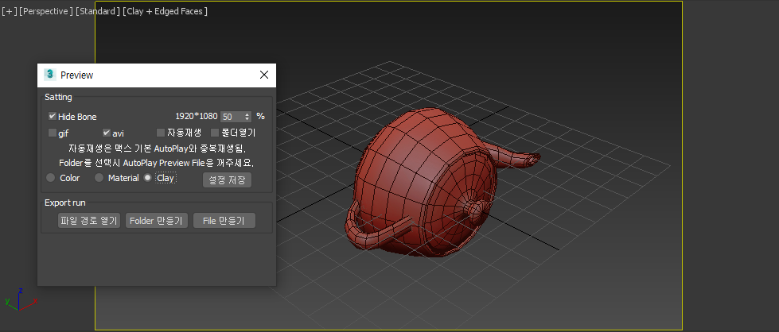
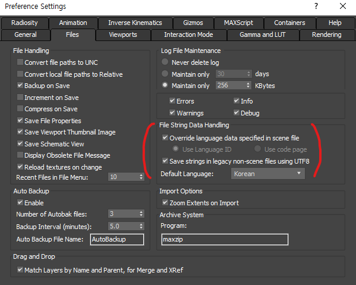

# SEO_preview
- https://github.com/nobodyInbody/SEO_preview
- 뷰리뷰 애니메이션을 빠르기 만들기(Quick preview)
> ffmpeg.exe을 사용함  
> 한글 사용으로 인해 Preference Settings 설정 필요.(하단의 이미지 참조)
## 화면
스크립트 화면  
  
Preference Settings 화면  

## 기능
- 맥스파일과 같은 이름, 같은 경로로 파일을 생성한다.
- gif와 mp4 파일로 생성
  - mp4는 libx264코덱을 적용해서 생성.
- Clay 모드로 브리뷰
- 재질 모드로 뷰리뷰

## 에러상황
프리뷰 파일 복사가 정상적으로 안될때는 MakePreview창의 output경로를 확인한다.
> 커스텀 경로로 되어 있을 경우 해당 경로로 저장되어 복사가 정상적으로 이루어지지 않는다 기본avi로 변경할 것
